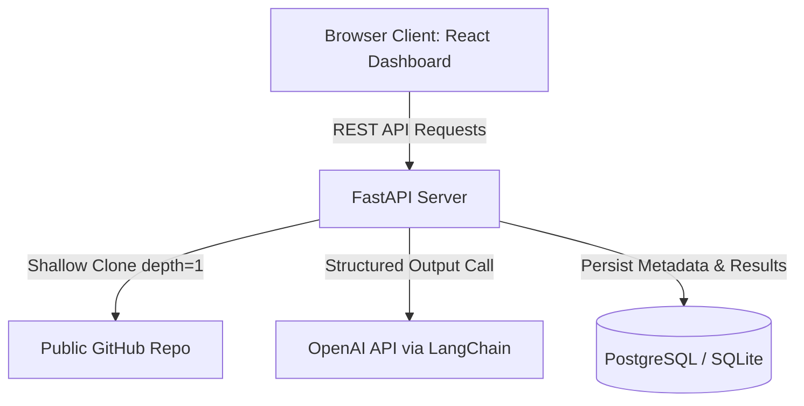

# ReviewAgent 🤖 | AI-Powered GitHub Code Review Assistant

ReviewAgent is an enterprise-grade, full-stack AI coding assistant that clones public GitHub repositories, crawls and filters their code structures, audits files (`.py`, `.js`, `.java`, etc.), and produces structured review cards (Security risks, Code Quality, Optimizations, Readability). 

It features a high-performance **FastAPI backend** utilizing **LangChain & OpenAI** function calls, a persistent **PostgreSQL DB**, and a **Vite React Frontend** utilizing a premium **Dark Modern Glassmorphic dashboard** with responsive stats, dynamic filter tabs, and side-by-side code diffing panels.

---

## 🏗️ Architecture Design



---

## 🛠️ Tech Stack & Features

- **Frontend**: React (Vite), custom HSL variables, raw responsive CSS, backdrop-blurs, glowing shimmers.
- **Backend**: FastAPI, SQLModel (ORM mapping), GitPython (shallow Git clones), LangChain (OpenAI Integration).
- **Database**: PostgreSQL (Dockerized) or SQLite (Local file fallback).
- **Environment**: Pydantic Settings loaders with local file overrides.
- **Containerization**: Multi-service Docker Compose networks.
- **CI/CD**: GitHub Actions linting, compilation testing, and configuration validation pipelines.

---

## 🚀 Getting Started

### 📋 Prerequisites
- [Python 3.11+](https://www.python.org/downloads/) (for running backend locally)
- [Node.js 18+](https://nodejs.org/) (for running frontend locally)
- [Docker & Docker Compose](https://www.docker.com/) (recommended for containerized execution)
- **OpenAI API Key** (required for generating reviews)

---

### Option A: Running with Docker Compose (Recommended)

1. Clone or navigate to the project directory:
   ```bash
   cd C:\Users\nalla\.gemini\antigravity\scratch\github-code-review-assistant
   ```

2. Open the `.env` file in the `backend/` directory or set the environment variable directly. Add your OpenAI API key:
   ```env
   OPENAI_API_KEY=sk-proj-YOUR_API_KEY_HERE
   ```

3. Boot the multi-container docker stack from the root folder:
   ```bash
   docker compose up --build
   ```
   *This starts the PostgreSQL database, clones files inside the backend container using standard system git, launches the FastAPI server at `localhost:8000`, and starts the React web client at `localhost:5173`.*

4. Access the web dashboard by navigating to [http://localhost:5173](http://localhost:5173).

---

### Option B: Running Locally (Frictionless / No Docker Needed)

ReviewAgent features a frictionless SQLite fallback. If no PostgreSQL database is running, SQLModel automatically creates a local database file `codereview.db` inside your backend folder, allowing you to run testing without local PostgreSQL setups.

#### 1. Start the Backend
1. Open a new terminal and navigate to the backend folder:
   ```bash
   cd backend
   ```
2. Install dependencies:
   ```bash
   pip install -r requirements.txt
   ```
3. Create a `.env` file from the template and paste your OpenAI key:
   ```bash
   copy .env.example .env
   ```
   Modify `.env` to include:
   ```env
   DATABASE_URL=sqlite:///./codereview.db
   OPENAI_API_KEY=sk-proj-YOUR_API_KEY_HERE
   ```
4. Run the development server:
   ```bash
   uvicorn app.main:app --reload --port 8000
   ```
   *The Swagger interactive API document will be accessible at [http://127.0.0.1:8000/docs](http://127.0.0.1:8000/docs).*

#### 2. Start the Frontend
1. Open a second terminal and navigate to the frontend folder:
   ```bash
   cd frontend
   ```
2. Install packages:
   ```bash
   npm install
   ```
3. Run the React Vite server:
   ```bash
   npm run dev
   ```
4. Open your browser and navigate to [http://localhost:5173](http://localhost:5173).

---

## 📁 Project Directory Breakdown

```
github-code-review-assistant/
├── backend/
│   ├── app/
│   │   ├── config.py         # Type-safe configuration settings via Pydantic
│   │   ├── database.py       # SQLModel engine initialization and DB dependencies
│   │   ├── models.py         # Relational database tables (Cascade Deletions)
│   │   ├── schemas.py        # Pydantic schema validation (Regex GitHub filters)
│   │   ├── crud.py           # Database transaction layers (Bulk additions)
│   │   ├── git_utils.py      # Git cloning and multi-language crawling
│   │   ├── reviewer.py       # LangChain OpenAI Structured Review generator
│   │   └── main.py           # FastAPI router handlers & Middleware
│   ├── Dockerfile            # Container build with custom git environments
│   └── requirements.txt      # Python dependencies
├── frontend/
│   ├── src/
│   │   ├── components/
│   │   │   ├── RepoInput.jsx        # Realtime validator and scanning visualizer
│   │   │   ├── SuggestionCard.jsx   # Review suggestions and side-by-side diff code
│   │   │   ├── AnalysisHistory.jsx  # History pins with status glows
│   │   │   └── Dashboard.jsx        # Metrics grids, filters, and health formulas
│   │   ├── App.jsx           # Coordinate state dispatches and pollers
│   │   ├── index.css         # Outfits CSS, neon glass card, pulses
│   │   └── main.jsx          # Entrypoint renderer
│   └── Dockerfile            # Frontend container compiler
├── docker-compose.yml        # Orchestrate DB, Backend, and Frontend services
└── README.md                 # Guides and architecture
```

---

## 🔒 Security & Code Quality Rules
- Cloned directories are temporarily held inside localized `temp_repos/` containers and deleted instantly via robust `shutil` error hooks upon pipeline completions.
- Injected source code files are restricted under **100KB** limits, and repositories are bound by **20 files** thresholds to prevent token-bloat exceptions.
- API models execute utilizing standard schema structures, validating data shapes strictly before database interactions.
